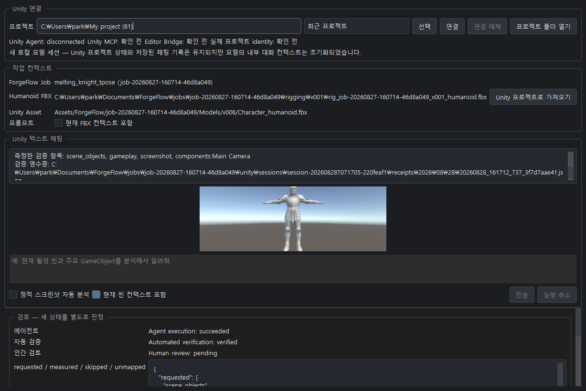
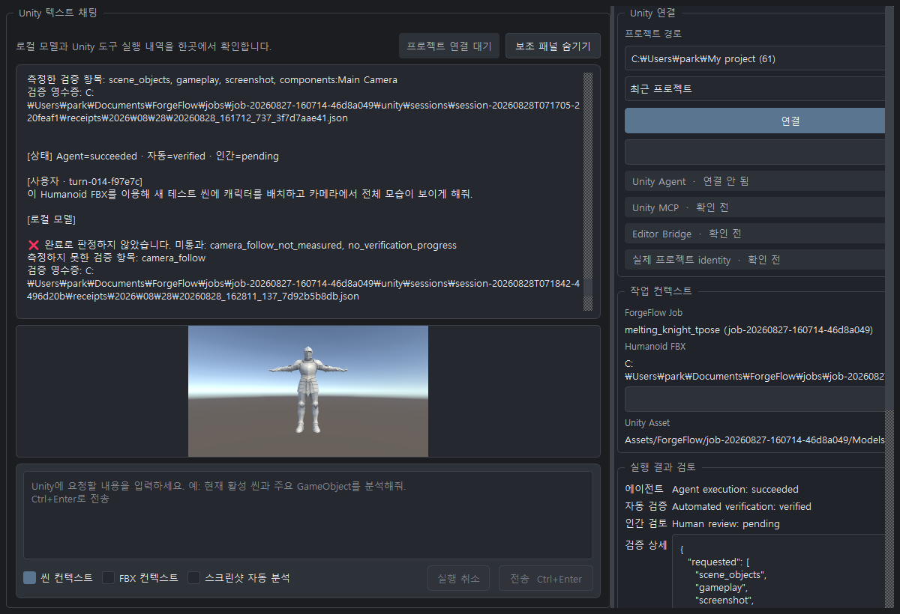

# 변경 이력

ForgeFlow의 사용자에게 영향을 주는 주요 변경 사항을 최신 버전부터 기록합니다.
변경 이력 관리는 `0.1.4`부터 시작하며 이전 버전의 변경 사항은 소급해 분류하지 않습니다.

## [0.1.4] - 2026-08-31

### Unity UI 비교 — Melting Knight

동일한 `melting_knight_tpose` 작업 데이터를 표시한 상태에서 비교했습니다.

| 이전 UI | → | 현재 UI |
|---|:---:|---|
|  | → |  |

### 추가

- 환경 연결 상태에 `Unity MCP` 항목을 추가하고 Unity Editor Bridge에 실제 `ping` 요청을 보내 연결 여부를 확인하도록 했습니다.
- Unity 텍스트 채팅에서 `Ctrl+Enter` 전송 단축키를 지원합니다.
- 채팅에 집중할 수 있도록 `보조 패널 숨기기/보기` 기능을 추가했습니다.

### 변경

- `4. Unity 텍스트 컨트롤` 화면을 채팅 중심의 2열 레이아웃으로 전면 개편했습니다.
- 채팅 영역이 화면 대부분을 사용하도록 확대하고 입력 영역을 채팅 하단에 고정했습니다.
- 프로젝트 연결, 작업 컨텍스트, 실행 결과 검토를 우측의 독립 스크롤 패널로 이동했습니다.
- 연결 상태를 단계별 상태 색상과 간결한 문구로 구분하고 주요 동작 버튼의 시각적 우선순위를 정리했습니다.
- 실행 결과 버튼을 2열로 재배치하고 긴 경로와 검토 정보가 좁은 화면에서도 읽히도록 줄바꿈을 개선했습니다.
- Unity 결과 스크린샷은 실제 이미지가 있을 때만 표시하여 평상시 채팅 공간을 확보했습니다.

### 배포

- 현재 애플리케이션 버전을 `0.1.4`로 지정했습니다.
- 패키지 버전의 단일 기준을 `forgeflow.__version__`으로 설정하고 프로젝트 메타데이터와 앱 표시 버전이 이를 사용하도록 정리했습니다.
