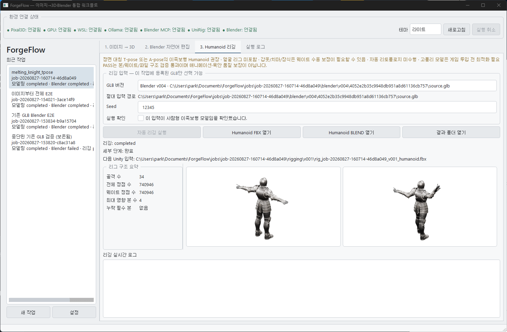

# ForgeFlow

> **An all-in-one orchestrator application to generate 3D models from images, modify assets, and automate rigging and animation in Unity—all from a single unified interface.**

ForgeFlow는 기존 Pixal3D 이미지→3D 생성기, 승인 기반 Blender 자연어 에이전트, 로컬 UniRig/Blender Humanoid 후처리, Unity Local Agent를 하나의 한국어 PySide6 Windows 앱에서 연결하는 오케스트레이터입니다. 각 프로젝트의 기존 실행 환경을 별도 프로세스로 사용하며, Unity 기능을 재구현하거나 Unity MCP를 직접 우회 호출하지 않습니다.

이전에 만들었던 모듈들을 합쳐, 하나의 앱에서 이미지를 넣어서 모델링 생성, 모델링 수정, Unity에서 리깅 및 애니메이션까지 한 곳에서 컨트롤할 수 있도록 통합화 중입니다.

<p align="center">
  
</p>
<p align="center"><sub>이미지 입력 → 3D 모델 생성 → Blender 편집 → Humanoid 리깅 → Unity 텍스트 제어</sub></p>

- **Image-to-3D Generation**: https://github.com/parkspark/modeling_local_mcp
- **Blender Control & Refinement**: https://github.com/parkspark/blender-control-mcp
- **Unity Rigging & Animation**: https://github.com/parkspark/unity_local_mcp


## 제공 기능

- PNG/JPG/JPEG 입력과 작업별 원본 복사
- Pixal3D 실시간 stdout/stderr 로그, GLB/BLEND/FBX 및 PNG 미리보기 검증
- 생성 GLB를 Blender 입력으로 자동 연결
- Blender/MCP/Ollama/WSL/GPU 연결 상태 표시
- `scene.inspect`로 실제 오브젝트 이름과 dimensions 표시
- 자연어 계획 생성과 승인 전 쓰기 차단
- 승인된 계획의 SHA-256을 고정한 뒤 동일 계획만 MCP로 실행
- `blender/vNNN` 버전과 GLB/BLEND/FBX 계보·해시 기록
- 원본 해시 불변 검사, 누락/0바이트 산출물 실패 처리
- 최신 Blender GLB(없으면 모델링 원본)를 입력으로 사용하는 버전별 UniRig 자동 리깅
- Unity Humanoid 본 이름 후처리, FBX/BLEND 구조 검증, rest/pose 미리보기
- 리깅 결과의 `unity_input_path` 등록으로 다음 Unity 단계 입력 고정
- Unity 프로젝트를 명시적으로 선택하고 실제 Editor project identity 확인
- 지속형 Unity Local Agent JSONL 세션에서 자유 텍스트 명령, 로컬 모델 응답, 도구 호출과 마일스톤 표시
- Humanoid FBX 선택 가져오기와 비덮어쓰기 `vNNN` Asset 경로·원본 SHA-256 기록
- Unity 실행 결과, 자동 검증, 인간 검토를 서로 독립된 상태로 저장
- Unity 로그, JSONL, receipt, 스크린샷과 수정 피드백 기반 `repair_existing` 재실행
- `job.json` 저장과 재시작 복구
- 파일/결과 폴더 열기, 실패 재시도, 실행 취소
- 상단 선택기로 즉시 전환하고 다음 실행에도 유지되는 중성 라이트/다크 테마

## 설치와 실행

앱의 `설정`에서 다음 실행부터 사용할 프로젝트 경로, Blender 실행 파일, 작업 루트, Ollama 주소/모델을 저장할 수 있습니다. ForgeFlow는 기존 시스템에서 확인한 `qwen3-coder:30b`와 설치된 Blender 5.2 경로를 기본값으로 사용하며 기존 프로젝트 설정 파일을 수정하지 않습니다.

### Windows EXE

처음 한 번만 프로젝트 루트에서 다음 명령으로 빌드합니다.

```powershell
python -m pip install -e ".[build]"
powershell -ExecutionPolicy Bypass -File .\scripts\build_exe.ps1
```

완료되면 `dist\ForgeFlow.exe`를 더블클릭해 실행할 수 있습니다. 콘솔 창은 열리지 않으며, 단일 EXE에 PySide6와 ForgeFlow 코드가 포함됩니다. 앱 설정과 작업 데이터는 기존과 동일하게 `Documents\ForgeFlow` 아래에 유지되므로 EXE를 다시 빌드해도 사라지지 않습니다.

소스에서 직접 실행하려면 다음 명령을 사용합니다.

```powershell
python -m pip install -e ".[dev]"
forgeflow
```

## 사용자 흐름

1. `새 작업`에서 이미지와 작업 이름을 선택합니다.
2. `모델 생성`을 누르면 현재 설정의 Ollama 모델을 VRAM에서 내린 뒤 기존 `generate_model.ps1`을 실행합니다.
3. GLB/BLEND/FBX와 미리보기가 모두 존재하고 0바이트가 아닐 때만 모델링을 완료로 기록합니다.
4. Blender 탭에서 `장면 검사`로 실제 메시 이름을 확인합니다.
5. 정확한 이름을 포함한 한국어 요청을 입력하고 `실행 계획 만들기`를 누릅니다.
6. 계획과 모든 구조화 인자를 검토한 뒤 `승인하고 실행`을 누릅니다. 취소하면 `asset.*` 도구는 호출되지 않습니다.
7. 결과는 새 `blender/vNNN/<operation-id>` 폴더에 저장되고 다음 편집의 기본 입력이 됩니다.
8. `3. Humanoid 리깅` 탭에서 실제 절대 GLB 경로와 부모 버전을 확인합니다. 가장 최신의 성공한 Blender GLB가 기본 선택되며 Blender 결과가 없으면 `modeling/source.glb`가 선택됩니다. 콤보박스에서 작업에 등록된 다른 GLB 버전을 명시적으로 선택할 수 있습니다.
9. 정면 대칭 T-pose/A-pose의 이족보행 사람형 모델임을 확인하고 Seed(기본 `12345`)를 지정한 뒤 최종 확인창의 입력·출력 경로를 검토하여 실행합니다.
10. ForgeFlow는 Ollama VRAM을 해제한 뒤 신뢰된 `RiggingAdapter`가 `rig_humanoid.ps1`을 실행 파일/인자 배열로 직접 호출합니다. 골격 생성, 스키닝, 메시 병합, Humanoid 후처리와 구조 검증을 모두 통과해야 완료됩니다.
11. 완료 후 Humanoid FBX/BLEND, 결과 폴더, rest/pose 미리보기를 탭에서 열 수 있습니다. 미리보기만 실패하면 구조 리깅은 `completed`로 유지하되 별도 경고를 표시합니다.
12. `4. Unity 텍스트 컨트롤` 탭에서 Unity 프로젝트를 선택하고, 해당 프로젝트를 연 Unity Editor Console의 `[McpBridge] Listening`을 확인한 뒤 `연결`합니다.
13. FBX가 필요하면 `Unity 가져오기`로 `Assets/ForgeFlow/<job-id>/Models/vNNN/Character_humanoid.fbx`에 복사하고 컨텍스트 포함을 선택합니다. FBX 없이도 일반 Unity 채팅은 사용할 수 있습니다.
14. 씬 분석, GameObject/UI/스크립트 생성, 컴파일 오류 수정, Play Mode 검사, 스크린샷 등 자유 텍스트 명령을 보냅니다. 같은 세션에서는 로컬 모델과 MCP 대화 상태가 유지됩니다.
15. 실행 성공 후에도 Unity 단계는 `awaiting_review`입니다. Unity Editor에서 실제 결과를 확인해 `결과 승인`해야만 `completed`가 됩니다. 반려 메모는 같은 결과의 수정 요청에 포함할 수 있습니다.

앱이 실행 중 강제 종료되면 `running` 단계는 다음 시작 시 `failed`로 복구되어 재시도할 수 있습니다. 완료된 `modeling/source.*`는 덮어쓰지 않습니다.

## 저장 형식

```text
jobs/<job-id>/
├─ job.json
├─ input/reference.png|jpg|jpeg
├─ modeling/source.glb, source.blend, source.fbx, preview.png
├─ blender/v001/<operation-id>/...
├─ rigging/v001/
│  ├─ rig_<ascii-job-id>_v001_skeleton.fbx
│  ├─ rig_<ascii-job-id>_v001_skin.fbx
│  ├─ rig_<ascii-job-id>_v001_rigged.glb
│  ├─ rig_<ascii-job-id>_v001_unity.blend, .fbx
│  ├─ rig_<ascii-job-id>_v001_humanoid.blend, .fbx
│  ├─ rig_report.json
│  ├─ rest_preview.png, pose_preview.png
│  └─ rigging.log
├─ unity/
│  ├─ imports/
│  ├─ sessions/<session-id>/
│  │  ├─ session.jsonl
│  │  ├─ turns/<turn-id>/request.txt, effective-prompt.txt, agent.log, run.jsonl, review.json
│  │  └─ screenshots/
│  └─ unity.log
├─ logs/
└─ .runs/                 # 엔진의 격리된 시도별 원본 출력
```

`job.json` 스키마 버전은 3입니다. schema v1/v2 작업은 기존 데이터를 손실하지 않고 Unity 단계와 세션/Turn 필드를 추가해 v3로 마이그레이션하며, 지원하지 않는 미래 버전은 거부합니다. UnitySession은 선택 프로젝트 identity와 프로세스 상태를, UnityTurn은 원문/effective prompt, 도구 결과, receipt, 자동 검증, 인간 검토를 저장합니다. `unity_input_path`는 검증에 성공한 최종 Humanoid FBX를 가리키지만 Unity 채팅의 필수 입력은 아닙니다.

## Unity 텍스트 컨트롤

연결 구조는 `ForgeFlow → unity_local_mcp --forgeflow-jsonl → Ollama 로컬 모델 → unity_mcp → Unity Editor`입니다. ForgeFlow는 항상 `--project`와 `UNITY_PROJECT_DIR`에 사용자가 선택한 절대 경로를 전달하고, 시작 `unity_ping`의 실제 `projectPath`가 일치할 때만 준비 완료로 표시합니다. Editor가 다른 프로젝트를 열고 있거나 Bridge가 준비되지 않으면 명령을 보내지 않습니다.

JSONL 세션은 한 Agent/UnityTools 인스턴스를 유지해 “속도를 낮춰줘”, “기존 결과를 수정해줘” 같은 후속 명령을 처리합니다. 앱 재시작이나 프로세스 종료 뒤에는 저장된 채팅은 남지만 모델 내부 컨텍스트는 초기화되었다는 안내를 표시합니다. 프로젝트를 바꾸면 기존 세션을 종료하고 새 세션을 만듭니다.

effective prompt에는 선택 프로젝트, 현재 Job, 사용자가 명시적으로 포함한 Asset, 최신 씬, 안전 규칙과 사용자 원문을 별도 섹션으로 담습니다. 선택 FBX 경로와 신규 출력 루트는 구조화 정책 필드로도 전달되어 다른 버전으로의 묵시적 대체를 차단합니다. 취소는 ForgeFlow가 시작한 Agent와 자식 MCP 프로세스만 종료하며 Unity Editor와 부분 산출물은 보존합니다.

검증 표시는 세 층입니다.

- Agent execution: `running`, `succeeded`, `failed`, `cancelled`
- Automated verification: receipt의 `verified`, `failed`, `partial`, `unavailable` 및 requested/measured/skipped/unmapped 항목
- Human review: `pending`, `accepted`, `rejected`

Agent 성공이나 receipt `verified`는 인간 승인이 아닙니다. 성공 Turn은 기본적으로 `awaiting_review`이며 사용자가 실제 Editor/Play Mode에서 승인한 뒤에만 Unity 단계가 `completed`가 됩니다. 정적 스크린샷 자동 분석은 캐릭터 노출, 화면 잘림, UI 겹침, T-pose, 크기와 조명 같은 정적 단서의 참고용입니다. 걷기 자연스러움, 발 미끄러짐, 입력감, 카메라 부드러움, 물리와 타이밍은 정적 이미지나 로컬 모델만으로 확정하지 않습니다.

## UniRig 환경과 성공 판정

기본 환경은 `Ubuntu-24.04`의 사용자 `park`, `/home/park/local-modeling/UniRig`, Conda 환경 `/home/park/miniforge3/envs/unirig`, 공식 체크포인트 캐시 `/home/park/.cache/huggingface/hub/models--VAST-AI--UniRig`입니다. 앱의 비동기 환경 표시줄은 PowerShell 진입점, WSL 배포판, UniRig Python/저장소/`src/model/sdpa_mha.py`/체크포인트, Blender를 점검합니다. 확인 기준 commit은 `6793c6640ff01c8fb389f3993434124bb43d2933`이며 다른 commit은 실제 값을 경고로 표시하되 그것만으로 실행을 차단하지 않습니다.

종료 코드 0만으로 성공하지 않습니다. 8개 핵심 파일의 존재/크기, 입력 GLB의 실행 전후 SHA-256, 파싱 가능한 `rig_report.json`, `status == "PASS"`, 양수인 본/정점 수, 빈 누락 본 배열, 전체 정점 웨이트, 1~4개의 최대 영향 본, report의 최종 FBX/BLEND 경로 일치를 모두 확인합니다. PASS는 파일·본·웨이트 구조 검사 통과일 뿐 애니메이션이나 변형의 육안 품질 보장이 아닙니다.

UniRig 업스트림은 WSL 경로의 공백을 처리하지 못합니다. 입력 또는 작업 출력 경로에 공백이 있으면 `%LOCALAPPDATA%\ForgeFlow\rigging-staging\<job-id>\vNNN` 아래의 공백 없는 경로로 입력을 복사해 실행하고, 검증된 결과만 실제 `rigging/vNNN`으로 옮깁니다. staging 루트 자체에 공백이 있으면 실행 전에 명확히 실패합니다. 실패/취소 중간 파일은 Job 산출물이나 `unity_input_path`로 등록하지 않으며 `rigging.log`는 진단용으로 남깁니다.

## 구조와 보안 경계

- `domain`: 작업, 단계, 산출물, 파이프라인 이벤트
- `services`: 원자적 저장, QProcess 실행, 작업 오케스트레이션, 환경 점검
- `adapters/modeling_adapter.py`: 기존 PowerShell 생성기 호출과 결과 정규화
- `adapters/blender_adapter.py`: 경로·버전·해시·세션 결과 검사
- `adapters/rigging_adapter.py`: GLB 입력/버전/staging/UniRig 명령/report/산출물/계보 검증
- `adapters/unity_adapter.py`: Unity Agent 환경/프로세스/JSONL 세션, 프로젝트 identity, FBX 가져오기, 로그·receipt·스크린샷, 취소와 fallback
- `adapters/blender_bridge.py`: blender-prompt-agent 가상환경에서 기존 에이전트/MCP 클래스만 호출하는 JSON Lines 브리지
- `ui`: 프로젝트, 모델링, Blender 계획/승인, 로그 패널

외부 프로세스는 실행 파일과 인자 배열로 시작하며 셸 문자열을 만들지 않습니다. Blender 브리지는 임의 Python/셸을 실행하지 않고 `blender-control-mcp`의 allow-list 도구만 사용합니다. 제안 단계는 읽기 도구만 자동 실행하고 항상 승인을 거부한 세션을 남깁니다. 승인 단계는 제안 JSON, 계획 SHA-256, 입력 경로, 출력 버전 폴더를 다시 검증한 뒤 정확히 그 계획만 실행합니다.

## 테스트

ForgeFlow:

```powershell
$env:PYTHONPATH = "$PWD\src"
python -m pytest -q
python -u -m forgeflow.main --smoke-test
```

기존 프로젝트 회귀 테스트:

```powershell
python -m pytest -q                                      # modeling_local_mcp
.\.venv\Scripts\python.exe -m pytest -q                # blender-prompt-agent
.\.venv\Scripts\python.exe -m pytest -q                # blender-control-mcp
```

실제 E2E 재실행:

```powershell
$env:PYTHONPATH = "$PWD\src"
python -u .\scripts\run_blender_e2e.py --asset C:\absolute\asset.glb --image C:\absolute\reference.png
python -u .\scripts\run_full_e2e.py --image C:\absolute\reference.png
python -u .\scripts\run_rigging_e2e.py --asset "C:\absolute\humanoid.glb" --seed 12345
python -u .\scripts\run_unity_e2e.py --project "C:\absolute\UnityProject" --job-id <job-id>
```

리깅 E2E는 반드시 ForgeFlow `RiggingAdapter`와 동일 검증 로직을 사용하며 `logs/rigging-e2e-evidence.json`에 입력 전후 해시, Seed, UniRig commit, 실행 시간/종료 코드, 모든 산출물 절대 경로·해시, report 핵심 값, 미리보기와 최종 판정을 기록합니다.

## 현재 제한

- Blender 자연어 탭의 지원 범위는 장면 검사, 재질 목록/속성, transform, Bevel, Decimate, Smooth shading, GLB/BLEND/FBX 내보내기입니다. 리깅은 LLM/MCP allow-list가 아니라 별도 신뢰 경계의 `RiggingAdapter`에서만 실행됩니다.
- 사람형 여부를 자동 판정하지 않습니다. 이족보행 Humanoid와 정면 대칭 T-pose/A-pose를 권장하며 얼굴 리그는 포함하지 않습니다.
- 자동 리토폴로지를 수행하지 않습니다. 고폴리 모델은 게임 투입 전 최적화가 필요하고 갑옷·치마·장식 메시의 웨이트는 수동 보정이 필요할 수 있습니다.
- Unity 텍스트 제어 범위와 결과 품질은 로컬 모델과 unity_mcp가 제공하는 구조화 도구에 의존합니다. 이번 통합은 일반 Unity 제어 오케스트레이션이며 애니메이션 전용 기능이 아닙니다.
- 자동 검증은 컴파일, 저장, 오브젝트/컴포넌트, Play Mode, 콘솔 오류, 스크린샷 등 객관 항목만 다룹니다. 동작 감각과 시각적 완성도의 최종 판정은 사람에게 남습니다.
- Unity Editor는 선택 프로젝트를 미리 열고 Bridge listener를 실행해야 합니다. ForgeFlow는 Editor를 강제 종료하지 않습니다.
- 자연어 계획 품질은 로컬 Ollama 모델에 의존하며 정확한 오브젝트/재질 이름이 요청에 없으면 에이전트가 실행 대신 후보 확인을 요구할 수 있습니다.
- Ollama가 구조화된 `tool_calls` 대신 설명문만 반환하면 ForgeFlow가 계획 형식을 한 번 자동 재요청합니다. 재요청도 실패하면 쓰기 작업 없이 실패로 표시합니다.
- Pixal3D 1024 생성은 이 PC의 실제 E2E에서 약 6분 이상 걸렸으며 UV 파라미터화 동안 GPU 사용률이 낮아도 CPU 작업이 계속될 수 있습니다.
- MCP의 고유 operation-id 하위 폴더는 비덮어쓰기 보장을 위해 유지합니다.
- `.runs`의 시도별 엔진 출력은 진단과 실패 증거를 위해 자동 삭제하지 않습니다.

## License

This project is licensed under the [Apache-2.0 License](LICENSE).
