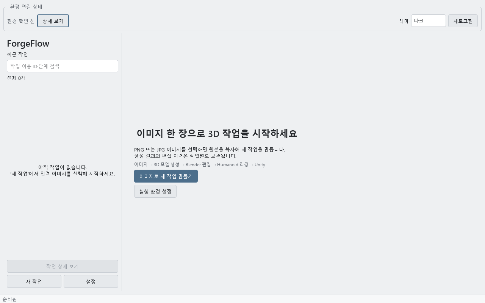
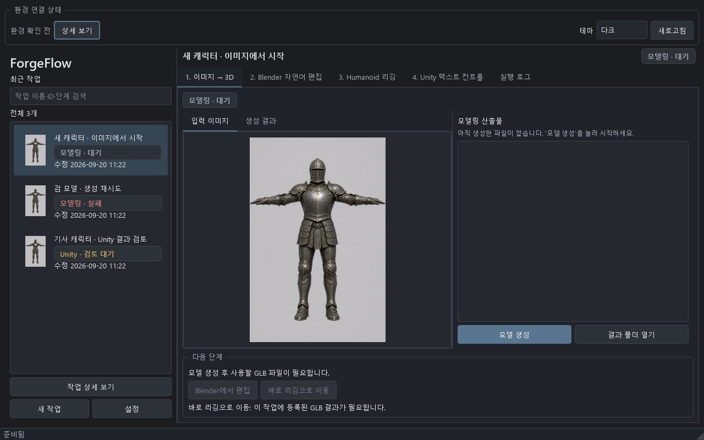

# UI/UX 개선 — 2026-09-20

실제 Qt 화면과 작업 전환·입력·검토 흐름을 점검하고, 확인된 사용성 문제를 수정했다.
작업 데이터 형식과 외부 생성·편집 엔진은 변경하지 않았다.

## 발견한 문제와 변경

| 문제 | 개선 |
| --- | --- |
| 첫 실행부터 빈 결과 목록과 사용할 수 없는 작업 버튼이 나타남 | 이미지 선택으로 시작하는 안내 화면과 새 작업·설정 진입 버튼 추가 |
| 작업이 많으면 스크롤로만 찾고, 갱신 때 선택이 바뀔 수 있음 | 이름·ID·단계·상태 검색, 결과 수, 검색 결과 없음 안내, 선택·스크롤 보존 |
| 검색 결과와 실제 열려 있는 작업을 혼동할 수 있음 | 본문 상단에 현재 작업 이름·상태를 명시하고 긴 이름은 툴팁·접근성 이름으로 제공 |
| 다음 단계 버튼이 비활성인 이유를 hover해야 알 수 있음 | 필요한 산출물과 버튼별 차단 사유를 본문에 표시, 화면 이동 동작임을 안내 |
| 모델링 탭에서 입력 이미지만 보여 생성 결과와 혼동됨 | 입력 이미지·생성 결과 탭 분리, 창 크기에 맞춘 비율 유지, 누락된 이미지의 이전 화면 제거 |
| Blender 작업 변경 후 이전 검사 결과·요청이 남음 | 작업·입력별 검사 결과와 초안을 분리, 현재 입력과 다른 승인 계획은 실행 차단 |
| 리깅 작업 변경 후 이전 로그·세부 단계가 남음 | 작업·실행 버전별 로그와 진행 상태 분리, 실제 리깅 실행 로그만 해당 패널에 전달 |
| Unity 연결 전 또는 실행 중 Ctrl+Enter가 초안을 지움 | 버튼과 단축키에 동일한 전송 조건 적용, 실제 새 실행 접수 전까지 초안 유지 |
| Unity 작업 전환 시 다른 프로젝트 경로·초안을 공유함 | 작업별 요청·프로젝트 경로 초안 보존, 새 작업에서는 해당 작업의 등록 경로 표시 |
| 새 응답이 채팅 읽던 위치와 검토 메모를 덮음 | 읽던 스크롤·선택 영역과 작성 중인 메모 유지 |
| 다른 작업의 늦은 응답·완료가 현재 화면을 바꿈 | 채팅·연결 상태·계획 화면 이동을 작업 ID로 구분, 백그라운드 완료가 현재 탭을 바꾸지 않음 |
| Unity 검증 결과를 JSON과 사용 불가능한 파일 버튼으로 표시 | 한국어 검증 요약·누락 항목·실패 원인·다음 행동 안내, 실제 존재하는 파일만 열기 활성화 |
| 큰 글꼴·긴 실패 안내에서 설정창 저장 버튼이 화면 밖으로 밀림 | 본문 스크롤과 하단 저장·취소 버튼 분리, 오류 위치 자동 스크롤, 필드 접근성 이름 추가 |
| 첫 화면·상태 제목 추가가 작은 창의 작업 영역을 압박 | 안내 화면도 스크롤 가능하게 구성하고 환경/로그 상세 높이를 화면 크기에 맞게 제한 |

## 검증

- 전체 자동 테스트 **215개 통과**, 7.01초. 기존 180개에 사용성·작업 격리 회귀 35개를 추가했다.
- `ruff check src tests` 통과.
- 작은 창 **1280×800 / 1024×768 / 853×533**, 환경·로그 상세 펼침/접힘 조합에서 탭·실행 취소·주요 동작 접근성 검사 통과.
- 설정창 **680×480**, 글꼴 **13px / 20px**, 모델 조회 실패 안내 조건에서도 저장 버튼과 검증 오류 접근 검사 통과.
- 다크·라이트 테마의 첫 실행, 모델링, Unity 검토 화면을 실제 Qt 위젯으로 렌더링하고 육안 확인했다. 예시 작업을 사용한 UI 검증이며 외부 엔진을 실행한 E2E는 아니다.
- Windows 검증 창은 열었으나 Computer Use의 **앱 접근 승인 시간이 만료**되어 실제 창의 클릭·타이핑 검증은 완료하지 못했다. 해당 제한을 Qt 자동 검사 통과와 구분한다.
- 사용자 작업·설정 대신 `logs/ui-ux-20260920/`의 격리된 예시 작업과 설정을 사용했다. 검증용 창은 종료했다.
- 새 `dist/ForgeFlow.exe` 빌드 성공. 기존 사용자 프로필과 분리한 `--smoke-test`에서 **3.966초, 종료 코드 0**, 임시 작업 루트 생성 확인. 증거: `exe-smoke.json`.

## 화면과 결과물

증거 폴더: `logs/ui-ux-20260920/`.

- 변경 전: `before-dark-modeling.png`, `before-light-modeling-empty.png`, `before-dark-unity.png`.
- 변경 후: `after-dark-modeling.png`, `after-light-modeling-empty.png`, `after-dark-unity.png` 및 반대 테마 버전.
- 테스트 로그: `tests-final.log`.
- 빌드 로그: `build.log`. 실행 파일: `dist/ForgeFlow.exe`.

실행 파일 크기는 **48,984,103바이트**이며 SHA256은
`4736F720858246572CD7366B17C2FAA451009AA38096C9D18FD1A2166D25EEC8`이다.

## 변경 범위

`main_window.py`, `theme.py`, `settings_dialog.py`, 모델링·Blender·리깅·Unity·작업 목록·다음 단계 패널과 관련 UI 회귀 테스트를 변경했다.
외부 엔진이나 사용자 프로젝트를 새로 실행·수정하지 않았다. 커밋·푸시는 수행하지 않았다.
