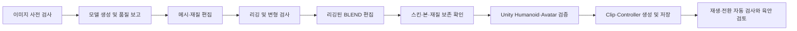

# 이미지 → 모델링 → 리깅 → Blender → Unity 애니메이션 개선 검토

2026-09-20. ForgeFlow와 modeling_local_mcp, blender-prompt-agent, blender-control-mcp, unity_local_mcp, unity_mcp를 함께 검토했다.

현재 가장 큰 공백은 **각 단계가 최신 결과를 이어받는지 보장하는 것**, **리깅된 결과를 다시 편집하는 것**, **Unity Humanoid·애니메이션 준비 상태를 실제로 확인하는 것**이다.

## 확인 범위

- 제품 소스와 9월 19일 실제 E2E 산출물을 읽고, 별도 fixture로 Python 경계 동작을 재현했다.
- 새 이미지 생성, UniRig, Blender, Unity, Ollama 실행은 하지 않았다. 이번 검토는 새로운 전체 E2E나 실제 애니메이션 재생 시험이 아니다.
- 제품 코드와 사용자 프로젝트는 수정하지 않았다. 문서 및 `logs/workflow-review-20260920/`의 감사 자료만 추가했다.
- 기존 Unity **6/6 성공은 요청했던 배치·Play 진입·스크린샷·카메라·원본 FBX 메시·화면 범위 검증**이다. 애니메이션 재생을 검증한 결과가 아니다.
- 아래에서 **실측**은 기존 실제 엔진 산출물, **재현**은 production 함수/추출한 함수에 통제된 데이터를 넣은 결과, **소스**는 실행 경로 확인, **제안**은 아직 구현하지 않은 기능을 뜻한다.

## 현재 흐름과 필요한 흐름

현재 기본 흐름은 이미지 → 모델 생성 → 선택적 Blender GLB 편집 → 리깅 → Unity로 FBX 복사 → 씬 배치/채팅이다. 사용자가 말한 **리깅 → Blender 컨트롤**은 기본 입력 선택에 연결되어 있지 않다.

목표는 다음과 같다.

모든 화살표에는 입력 버전·해시, 출력 버전, 사용한 설정이 연결되어야 한다. 이전 결과는 이력으로 보존하고 현재 결과와 구분한다.

## 우선 개선할 12개 항목

### 1. P1 — 재작업 후 최신 산출물과 승인 상태가 어긋남

**확인:** Blender 편집 완료 후 리깅·Unity 상태가 `completed`로 남고 이전 승인도 유지된다. 리깅 v2 등록 후 `unity_input_path`는 v2이지만 `unity_asset_path`는 이전 v1이다. Unity 프롬프트는 **v1 FBX + 최신 리깅 PASS**를 함께 사용한다. 별도 fixture에서 production 완료 핸들러·등록 함수를 호출하여 재현했다.

**영향:** 사용자는 최신 결과를 대상으로 요청했다고 생각하지만 이전 캐릭터를 편집하거나 검토할 수 있다. 과거 승인 자체는 유효한 이력이지만 현재 버전의 승인으로 취급하면 안 된다.

**개선:** 입력/출력 artifact ID·SHA·부모 버전·Unity 프로젝트 ID를 가진 연결 기록을 둔다. 상위 결과가 바뀌면 하위 단계를 `재생성 필요`/`재가져오기 필요`로 표시하고, 현재 선택의 승인만 따로 계산한다. Unity 프로젝트 변경도 같은 규칙을 적용한다.

**완료 기준:** v1 승인 → Blender v2 → 리깅 v2 후 v1을 묵시적으로 요청에 포함할 수 없어야 한다. v1은 사용자가 명시적으로 선택하면 재사용 가능해야 한다.

근거: [pipeline_service.py:241](C:/Users/park/Desktop/dev_tool/ForgeFlow/src/forgeflow/services/pipeline_service.py:241), [rigging_adapter.py:346](C:/Users/park/Desktop/dev_tool/ForgeFlow/src/forgeflow/adapters/rigging_adapter.py:346), [prompts.py:35](C:/Users/park/Desktop/dev_tool/ForgeFlow/src/forgeflow/adapters/unity/prompts.py:35), [재현 JSON](C:/Users/park/Desktop/dev_tool/ForgeFlow/logs/workflow-review-20260920/boundary-probes.json).

### 2. P1 — Blender 모디파이어 결과가 다음 GLB에 반영되지 않는 경로

**확인:** Bevel/Decimate 도구는 modifier를 추가하며, GLB export 호출은 `export_apply`를 생략한다. 설치된 Blender 5.2 exporter의 기본값은 `False`다. 다음 편집 및 리깅 입력은 이 GLB가 된다. **설치 소스까지 확인한 조건부 손실 경로**이며 실제 Blender round-trip 손실을 새로 측정하지는 않았다.

FBX도 기본 export 옵션에 의존하여, 리깅 exporter가 명시한 leaf bone 제외·animation bake 제외·texture embedding 정책을 계승하지 않는다. 실제 손실을 단정할 수는 없지만 편집 종류에 따라 출력 계약이 달라질 수 있다.

**개선:** 편집 목적별 export profile을 정의한다. 정적 메시에서는 평가된 geometry를 전달하고, 리깅 이후에는 Armature·shape key·vertex order 보존을 고려해 허용할 modifier와 적용 방식을 제한한다. 무조건 모든 modifier를 적용하는 방식은 피한다. 재임포트한 결과의 vertex/triangle 수·bounds·스킨을 비교한다.

**완료 기준:** Decimate한 결과를 GLB로 다시 열었을 때 감소한 geometry가 유지되고, 리깅된 결과에서는 본·weight·bind pose가 보존되어야 한다.

근거: [blender_mcp_bridge.py:336](C:/Users/park/Desktop/dev_tool/blender-control-mcp/src/blender_control_mcp/scripts/blender_mcp_bridge.py:336), [export:360](C:/Users/park/Desktop/dev_tool/blender-control-mcp/src/blender_control_mcp/scripts/blender_mcp_bridge.py:360), [pipeline_service.py:260](C:/Users/park/Desktop/dev_tool/ForgeFlow/src/forgeflow/services/pipeline_service.py:260).

### 3. P1/P2 — 정상 소품 보존과 실제 weight 검사

**확인:** 주 메시 외에 Armature modifier와 vertex group이 없는 메시는 출처 확인 없이 모두 삭제한다. 모의 정상 `UserHelmet` 삭제를 재현했다. 또 `vertex.groups` 존재만 weighted로 세므로 weight 합계가 0인 두 정점도 보고서상 모두 weighted가 되고 호스트가 수락한다. 검사는 가장 큰 메시를 중심으로 이루어진다.

**영향:** 무스킨 소품이 사라지거나, 구조 PASS인데 실제 변형에 기여하는 weight가 없는 결과를 놓칠 수 있다. 기존 실제 E2E에서 이 두 문제가 발생했다고 주장하는 것은 아니다.

**개선:** 생성 출처가 확인된 디버그 객체만 삭제하고, 나머지는 스킨 메시/강체 부착물로 구분해 유지한다. 모든 유지 메시에서 유효한 deform bone, 양수·유한 weight, 정규화 합계, 영향 본 수, Armature 대상, 누락된 bind 관계를 검사한다. 장비/의상 포함 fixture와 실제 Blender 결과로 검증한다.

근거: [humanoid_postprocess.py:114](C:/Users/park/Desktop/dev_tool/modeling_local_mcp/scripts/humanoid_postprocess.py:114), [weight 통계:154](C:/Users/park/Desktop/dev_tool/modeling_local_mcp/scripts/humanoid_postprocess.py:154), [재현 JSON](C:/Users/park/Desktop/dev_tool/ForgeFlow/logs/workflow-review-20260920/modeling-rigging-proof.json).

### 4. P1 — Humanoid라는 파일명과 실제 Unity Rig 설정이 다름

**실측:** 기존 성공 E2E의 FBX `.meta`는 `animationType: 2`(Generic), `avatarSetup: 0`, `human: []`다. 현재 가져오기는 FBX 복사·해시 비교이며 ModelImporter Humanoid 설정이나 `Avatar.isValid/isHuman` 확인이 없다.

**개선:** 선택한 FBX에 대해 Humanoid 설정 → 명시적 본 매핑/자동 매핑 → 재임포트 → Avatar 존재·유효성·human 여부·필수 본 확인을 전용 MCP 경로로 제공한다. 화면도 `FBX 복사됨`과 `Humanoid 준비됨`을 구분한다. Generic 애니메이션을 선택한 작업에는 그에 맞는 별도 기준을 적용한다.

Unity는 Humanoid 사용 시 Rig 종류와 Avatar 매핑을 설정하도록 안내한다. Generic으로 임포트되었다는 사실만으로 모든 본 애니메이션이 불가능하다고 볼 수는 없다. [Unity 공식 문서](https://docs.unity3d.com/6000.0/Documentation/Manual/ConfiguringtheAvatar.html).

근거: [실제 FBX.meta:105](C:/Users/park/Desktop/dev_tool/ForgeFlow/logs/unity-mcp-hardening-20260919/unity-project/Assets/ForgeFlow/job-20260919-225630-32f42485/Models/v001/Character_humanoid.fbx.meta:105), [project.py:39](C:/Users/park/Desktop/dev_tool/ForgeFlow/src/forgeflow/adapters/unity/project.py:39).

### 5. P1 — 애니메이션 요구가 자동 검증에서 조용히 빠짐

**재현:** “Idle 애니메이션 반복 재생 + Play 전신 스크린샷 검증”은 배치·Play·스크린샷 검사만 추출하며 `unmapped_requirements=[]`다. “Idle/Walk clip 연결·재생 확인”은 Player 이동/컴포넌트 검사로 해석되기도 한다. 실제 잘못된 애니메이션이 실행되어 통과했다는 실측이 아니라 **production 검사 명세 추출의 결함**이다.

추가로 ForgeFlow receipt parser는 `status=verified`, 요청 3개/측정 1개, skipped/unmapped가 빈 입력도 `verified`로 표시한다. 기존 정상 host receipt가 이 형태였다는 뜻은 아니며 수신 경계 검증이 부족하다는 증거다.

**개선:** 우선 지원하지 않는 애니메이션 요구를 미검증으로 보존한다. 이어 Avatar/Controller/Clip ID, 현재 state, clip weight·시간 진행, 샘플 본 transform 변화, 전환 조건을 검사한다. 시간 진행만으로 실제 스킨 변형을 보장하지 않으므로 변형 검사도 함께 둔다. 시각적 자연스러움·발 미끄러짐은 자동 수치와 사람 검토를 구분한다. receipt에서는 요청 집합과 측정 집합의 실제 포함 관계를 검증한다.

근거: [verification.py:244](C:/Users/park/Desktop/dev_tool/unity_local_mcp/verification.py:244), [검사 목록:837](C:/Users/park/Desktop/dev_tool/unity_local_mcp/verification.py:837), [receipts.py:17](C:/Users/park/Desktop/dev_tool/ForgeFlow/src/forgeflow/adapters/unity/receipts.py:17), [애니메이션 요구 재현](C:/Users/park/Desktop/dev_tool/ForgeFlow/logs/workflow-review-20260920/unity_animation_review_repro.json).

### 6. P2 — 리깅 → Blender 편집을 정식 경로로 추가

**확인:** 리깅 성공은 humanoid BLEND/FBX 및 Unity 입력을 갱신하지만 Blender 입력은 이전 GLB다. UI 다음 단계도 GLB를 요구한다. 하위 Blender bridge가 BLEND/FBX를 열 수 있는 것과 ForgeFlow에서 그 결과를 선택·추적할 수 있는 것은 별개다. 현재 도구는 재질·transform·modifier 중심이며 bone/pose/weight/action 편집은 전용 경로가 없다.

**개선:** `메시 편집`과 `리깅 후 편집` 모드를 나누고, 후자는 네이티브 BLEND를 기본 입력으로 선택한다. 먼저 본 검사·pose reset·제한된 pose 조정·weight 진단을 제공하고 IK/FK·action/keyframe은 확장한다. 후처리 결과를 Unity용 FBX의 새 버전으로 연결한다. 일반 transform도 부모·자식에 중복 적용하지 않도록 root/선택 범위를 명시한다.

**완료 기준:** 모델 생성 → 리깅 → Blender 자세/소품 수정 → Unity 임포트에서 skeleton·weight·재질이 유지되며 새 수정이 정확히 보인다.

근거: [main_window.py:497](C:/Users/park/Desktop/dev_tool/ForgeFlow/src/forgeflow/ui/main_window.py:497), [rigging_adapter.py:346](C:/Users/park/Desktop/dev_tool/ForgeFlow/src/forgeflow/adapters/rigging_adapter.py:346), [schemas.py:17](C:/Users/park/Desktop/dev_tool/blender-prompt-agent/src/blender_prompt_agent/schemas.py:17), [Blender 경계 재현](C:/Users/park/Desktop/dev_tool/ForgeFlow/logs/workflow-review-20260920/blender-boundary-probes.json).

### 7. P2 — Unity 애니메이션 생성과 저장을 전용 도구로 제공

**확인:** 일반 컴포넌트 추가/속성 설정은 있지만 Avatar 설정, FBX 내부 특정 Clip 선택, Controller 상태 머신 생성, runtime Animator 진단 도구는 없다. Editor C# 생성으로 구현할 수 있으므로 기능 자체가 불가능한 것은 아니다.

**개선:** 다음처럼 작고 명확한 작업 단위로 제공한다. 이름은 제안이며 현재 구현된 도구가 아니다.

- Avatar 구성·진단, FBX clip/subasset 목록과 안정적인 ID 조회.
- 기존 모션의 연결/리타게팅, 간단한 절차적 clip 생성, 외부 모션 생성 서비스 연동을 구분. 걷기 등 모션 품질을 동일하게 보장한다고 표시하지 않음.
- `.anim`/`.controller` 생성·저장, Idle/Walk 상태와 속도 파라미터·전환 설정, Animator 연결.
- Play에서 state/clip/time/전환 상태 조회 및 재생 검증.

초기 제품 흐름은 **유효한 Avatar + Idle/Walk 클립 + 2-state Controller + 저장 후 다시 열어 재생 확인**으로 제한하면 완료 조건이 명확하다.

근거: [server.py:195](C:/Users/park/Desktop/dev_tool/unity_mcp/server.py:195), [Bridge 컴포넌트 설정:1237](C:/Users/park/Desktop/dev_tool/unity_mcp/UnityBridge/UnityMcpBridge.cs:1237), [자산 참조 해석:1881](C:/Users/park/Desktop/dev_tool/unity_mcp/UnityBridge/UnityMcpBridge.cs:1881).

### 8. P2 — 애니메이션 자산도 변경 목록과 복구에 포함

**재현:** 요청에 명시한 `.controller`, `.anim`, `.overrideController` 경로가 추출되지 않는다. 임시 파일 기반 snapshot 복구에서 C#은 복구되지만 변경된 Controller와 새 Clip이 남는다. 실제 Unity asset 내용의 유효성을 검사한 재현은 아니다.

**개선:** 전용 생성 도구가 변경/생성 자산 및 `.meta`의 manifest를 반환하도록 한다. 자동 복구와 사용자 검토가 같은 manifest를 사용해야 한다. 사용자 자산 전체를 무차별 snapshot/삭제하지 않고 해당 실행이 수정한 범위를 추적한다.

근거: [preflight.py:10](C:/Users/park/Desktop/dev_tool/unity_local_mcp/preflight.py:10), [snapshot.py:21](C:/Users/park/Desktop/dev_tool/unity_local_mcp/snapshot.py:21), [재현 JSON](C:/Users/park/Desktop/dev_tool/ForgeFlow/logs/workflow-review-20260920/unity_animation_review_repro.json).

### 9. P2 — 이미지·모델 파일 사전 검사와 입력 준비 UX

**재현:** 내용이 텍스트인 `.png`와 `.glb`도 검증을 통과하고, 손상된 PNG도 preview artifact로 등록된다. 빈 FBX는 Unity 복사 단계가 성공한다.

**개선:** 이미지 decode·크기·방향, GLB 구조/chunk/mesh, FBX 비어 있음·등록 해시·엔진 임포트 결과를 단계별로 확인한다. 단순 파일 검증과 사람형/포즈 적합성 판정은 구분한다.

**UI 제안:** 생성 전 crop·배경 제거 결과를 비교하고, 전신 누락/팔다리 겹침/정면 대칭/T·A pose 여부를 안내한다. 원본은 보존한다. 비사람형에는 Humanoid 흐름을 강제하지 말고 Generic/수동 작업 경로를 제시한다. 다중 시점 입력은 사용 모델이 지원하는 경우에만 별도 옵션으로 제공한다.

근거: [job_service.py:42](C:/Users/park/Desktop/dev_tool/ForgeFlow/src/forgeflow/services/job_service.py:42), [rigging_adapter.py:75](C:/Users/park/Desktop/dev_tool/ForgeFlow/src/forgeflow/adapters/rigging_adapter.py:75), [project.py:39](C:/Users/park/Desktop/dev_tool/ForgeFlow/src/forgeflow/adapters/unity/project.py:39).

### 10. P2 — 비싼 모델 생성 후 파일 수집만 실패한 경우 복구

**재현:** 원본 3종의 두 번째 복사에 오류를 주입하면 첫 canonical GLB만 남고 artifact 등록은 0이다. 다음 시도는 불완전 등록을 이유로 새 작업을 요구한다. 정상 원본 등록 후 미리보기만 실패한 경우의 기존 복구 기능은 이 문제와 다르며 이미 동작한다.

**개선:** staging 검증 → 수집 manifest → 원본 게시·등록 순서로 처리하고 재시작 시 수집만 재개한다. `.runs`의 생성 결과를 재사용하고 실패 원인을 `생성 실패`와 `결과 수집 실패`로 구분한다.

근거: [modeling_adapter.py:77](C:/Users/park/Desktop/dev_tool/ForgeFlow/src/forgeflow/adapters/modeling_adapter.py:77), [복구 검사:103](C:/Users/park/Desktop/dev_tool/ForgeFlow/src/forgeflow/adapters/modeling_adapter.py:103), [오류 주입 결과](C:/Users/park/Desktop/dev_tool/ForgeFlow/logs/workflow-review-20260920/modeling-rigging-proof.json).

### 11. P2 — 설정한 Blender 경로를 모든 단계에서 사용

**확인:** 앱 설정의 Blender 경로는 환경 검사/미리보기에서 사용하지만 생성/리깅 PS1 인자로 전달되지 않는다. PS1은 개인 Applications/Program Files의 고정 Blender 경로를 사용한다. 다른 위치를 설정하면 환경 검사와 실제 변환이 서로 다른 실행 파일을 사용할 수 있다.

**개선:** 실행 경로를 명시적 인자로 끝까지 전달하고 실제 사용할 Blender 버전을 화면에 표시한다. WSL 배포판·사용자·모델 설치 위치도 환경 profile로 옮기는 것은 후속 이식성 개선이다.

근거: [modeling_adapter.py:56](C:/Users/park/Desktop/dev_tool/ForgeFlow/src/forgeflow/adapters/modeling_adapter.py:56), [rigging_adapter.py:181](C:/Users/park/Desktop/dev_tool/ForgeFlow/src/forgeflow/adapters/rigging_adapter.py:181), [rig_humanoid.ps1:101](C:/Users/park/Desktop/dev_tool/modeling_local_mcp/scripts/rig_humanoid.ps1:101), [convert_model.ps1:20](C:/Users/park/Desktop/dev_tool/modeling_local_mcp/scripts/convert_model.ps1:20).

### 12. P2 — 게임 투입 품질과 애니메이션 검토 UX

**실측:** 기존 리깅 report는 733,181 vertices이며 원본 GLB는 977,525 triangles다. 이는 고밀도 사례로서 예산 검토가 필요하다는 근거다. 대상 플랫폼·화면 점유율·등장 수를 정하지 않은 상태에서 성능 실패라고 단정하지 않는다. 현재 rest/pose 두 장도 시간에 따른 변형 품질을 입증하지 않는다.

**개선:** 모델 품질 보고서에 triangle/vertex/material/texture 수, 크기·축·bounds, 스킨 통계와 목표 예산을 표시한다. 실제 export 축 변환은 이미 있으므로 누락으로 취급하지 않는다. LOD/retopo/texture bake는 선택한 예산에 맞춰 제안하고 결과를 별도 버전으로 저장한다.

| UI 위치 | 제안 | 사용자가 판단할 수 있는 것 |
|---|---|---|
| 각 단계 상단 | 입력 버전 → 현재 출력 → 다음 단계 사용 버전, 오래된 결과 배지 | 지금 어떤 캐릭터를 편집하는가 |
| 모델/리깅 미리보기 | 회전·확대, wireframe, bone/weight overlay, 전후 비교 | 형상·스킨·의상 손실 여부 |
| Unity 가져오기 | 복사됨 / 임포트됨 / Avatar 유효 / Controller 연결 / 재생 확인을 구분 | 정확히 어디까지 준비됐는가 |
| 애니메이션 패널 | clip 목록·길이·루프·속도·root motion·Idle/Walk 프리셋·타임라인 | 원하는 동작을 어떻게 수정할 것인가 |
| 검토 화면 | 반복 영상/여러 시점, 시간 위치에 연결된 피드백 | 어느 프레임에서 관통·발 미끄러짐이 생기는가 |
| 오류 화면 | 실패한 단계 재시도, 직전 정상 버전, 재생성 예상 범위 | 어느 부분부터 다시 해야 하는가 |

근거: [실제 rig_report.json](C:/Users/park/Desktop/dev_tool/ForgeFlow/logs/e2e-audit-20260919/jobs/job-20260919-204636-fd88dca3/rigging/v001/rig_report.json), [메시 통계](C:/Users/park/Desktop/dev_tool/ForgeFlow/logs/workflow-review-20260920/modeling-rigging-proof.json), [현재 리깅 UI:42](C:/Users/park/Desktop/dev_tool/ForgeFlow/src/forgeflow/ui/panels/rigging_panel.py:42).

## Blender 제어에서 추가로 확인한 세부 결함

| 항목 | 확인된 동작과 증거 한계 | 개선 |
|---|---|---|
| P1 전체 변환 중복 | `target=all`이 부모 Armature와 자식 메시 각각의 local scale을 설정한다. 단순 parent inverse 조건의 격리 계산에서 2배 요청이 자식 effective scale 4배가 된다. 실제 Blender 장면 측정은 아님 | root 단위 변환, world/local 및 상대/절대 모드 구분 |
| P2 텍스처 색 변경의 성공 표시 | 연결된 Base Color의 default만 바꾸고 연결과 upstream 색은 유지한 채 changed_materials를 반환. 경고는 stdout에만 남음. 렌더 비교는 미실행 | texture를 보존하는 tint 연산 또는 미지원 결과와 구조화된 경고 |
| P2 FBX 단독 내보내기 계약 충돌 | 하위 schema는 `formats=['fbx']`를 허용하지만 ForgeFlow 수집기는 BLEND/GLB까지 요구하여 실패. 실제 수집기와 임시 파일로 재현 | 승인 계획과 수집기의 required_formats를 일치시키고 master BLEND 보존과 사용자 export를 구분 |

근거: [Blender 상세 검토](C:/Users/park/Desktop/dev_tool/ForgeFlow/logs/workflow-review-20260920/blender-review.md), [재현 결과](C:/Users/park/Desktop/dev_tool/ForgeFlow/logs/workflow-review-20260920/blender-boundary-probes.json), [transform:324](C:/Users/park/Desktop/dev_tool/blender-control-mcp/src/blender_control_mcp/scripts/blender_mcp_bridge.py:324), [material:307](C:/Users/park/Desktop/dev_tool/blender-control-mcp/src/blender_control_mcp/scripts/blender_mcp_bridge.py:307), [collector:137](C:/Users/park/Desktop/dev_tool/ForgeFlow/src/forgeflow/adapters/blender_adapter.py:137).

## 권장 구현 순서와 검증

1. **결과 보존과 상태 정확성:** 1·2·3·5를 우선 처리한다. 재작업 lineage, GLB export 보존, 소품/weight 검사, 애니메이션 미검증 표시를 먼저 고친다. 입력 검사·Blender 경로 전달은 병행 가능한 범위다.
2. **리깅 이후 연결:** 4·6을 구현한다. 네이티브 BLEND 편집부터 명시적인 Unity Humanoid/Avatar 검증까지 연결하고 왕복 fixture를 실제 Blender/Unity에서 실행한다.
3. **애니메이션 최소 완성 흐름:** 7·8과 5의 실제 재생 검사를 함께 구현한다. 실제 로컬 모델이 MCP를 사용해 Idle/Walk Controller를 만들고 저장하도록 한 뒤, Unity 재진입 후 clip/state/변형 검사를 한다. 수동으로 성공 씬을 만들어 E2E로 대체하지 않는다.
4. **품질과 반복 작업 UX:** 9·10·12의 사전 검사·수집 복구·비교/영상 검토를 확장한다. 게임 예산은 목표 플랫폼에 맞춰 설정한다.

우선 E2E 시나리오는 단일 캐릭터 성공뿐 아니라 **재리깅 후 최신 버전 사용**, **소품 포함 다중 메시**, **Decimate 후 실제 geometry**, **0 weight 거부**, **Avatar 실패 표시**, **Controller 저장 후 재시작**, **Idle→Walk 전환**, **자동 복구 후 자산 일치**를 포함해야 한다.

## 증거 묶음

- [교차 단계/receipt/빈 FBX 재현 스크립트](C:/Users/park/Desktop/dev_tool/ForgeFlow/logs/workflow-review-20260920/reproduce_boundaries.py), [결과](C:/Users/park/Desktop/dev_tool/ForgeFlow/logs/workflow-review-20260920/boundary-probes.json)
- [이미지·모델·리깅 상세 검토](C:/Users/park/Desktop/dev_tool/ForgeFlow/logs/workflow-review-20260920/modeling-rigging-review.md), [재현 스크립트](C:/Users/park/Desktop/dev_tool/ForgeFlow/logs/workflow-review-20260920/modeling-rigging-proof.py)
- [Blender 경계 재현 스크립트](C:/Users/park/Desktop/dev_tool/ForgeFlow/logs/workflow-review-20260920/blender-boundary-probes.py), [결과](C:/Users/park/Desktop/dev_tool/ForgeFlow/logs/workflow-review-20260920/blender-boundary-probes.json)
- [Unity 애니메이션 상세 검토](C:/Users/park/Desktop/dev_tool/ForgeFlow/logs/workflow-review-20260920/unity-animation-review.md), [재현 스크립트](C:/Users/park/Desktop/dev_tool/ForgeFlow/logs/workflow-review-20260920/unity_animation_review_repro.py)
