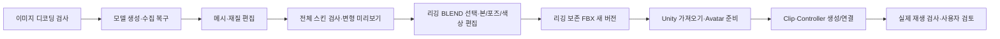

# 워크플로 개선 기록 — v0.2.0

2026-09-20. [사전 검토](workflow-improvement-review-2026-09-20.md)에서 확인한 단계 간 버전 불일치, 리깅 후 편집 손실, Unity Avatar·애니메이션 검증 공백을 ForgeFlow와 연결 프로젝트 5개에서 개선했다.

## 변경한 사용자 흐름

Blender에서 등록된 GLB/BLEND/FBX 버전을 선택할 수 있고, 리깅 성공 후에는 Humanoid BLEND가 기본 입력이 된다. 편집 결과도 BLEND를 우선해 다음 편집으로 전달한다. Unity에는 `Avatar 준비 요청`과 `애니메이션 연결 요청` 초안 버튼을 추가했다. 버튼은 요청 내용을 채우며 사용자가 검토하여 전송한다.

## 1. 현재 입력과 과거 결과 구분

- Job 스키마를 v4로 올리고 기존 v1/v2/v3 기록을 보존하며 마이그레이션한다.
- 메시 수정·재리깅·Unity 프로젝트 변경 시 기존 가져오기·현재 씬·스크린샷을 해제하고 이전 결과를 `stale`로 표시한다. 과거 Turn과 승인 기록은 남지만 현재 버전의 승인으로 사용하지 않는다.
- Unity 가져오기 기록에 원본 경로·SHA-256·프로젝트를 저장한다. 전송 전 선택 FBX와 복사본의 실제 바이트도 다시 비교한다.
- Blender 계획 당시 입력 해시를 기록한다. 입력 선택이나 파일 내용이 달라지면 새 계획이 필요하다.
- 이전 Unity Turn의 늦은 완료·종료 신호가 새 입력 버전의 상태를 덮어쓰지 않게 했다.

## 2. 입력 검사와 중단 복구

- PNG/JPEG는 Qt로 실제 디코딩하고 크기를 검사한다. GLB는 헤더·청크·JSON·메시 기본 구조를 검사하고 빈 FBX는 Unity 복사 전에 거부한다.
- 미리보기는 이미지 디코딩과 갱신 여부를 확인한다. Blender 스크립트 예외가 종료 코드 0으로 숨지 않도록 `--python-exit-code 1`을 전달한다.
- 모델 생성 후 표준 위치로 파일을 수집하기 전에 원본 실행 폴더와 해시 manifest를 남긴다. 수집 중단 후에는 동일 원본과 이미 복사된 결과를 확인하고 누락된 파일만 이어서 수집한다.
- 앱에 설정한 Blender 실행 파일을 생성·변환·리깅 PowerShell 진입점과 preview까지 전달한다. 잘못된 명시 경로는 고비용 생성 전에 실패한다.

## 3. 리깅 후 Blender 편집과 출력 보존

`blender-control-mcp`와 `blender-prompt-agent`를 함께 수정했다.

- `rig.inspect`, `rig.pose`, `rig.reset_pose`, `material.tint`를 추가했다.
- 전체 캐릭터 변환은 최상위 객체에 적용하여 부모·자식 중복 변환을 방지한다.
- 정적 메시의 GLB는 평가된 modifier geometry를 내보낸다. 스킨/Shape Key 메시에서 보존을 보장하기 어려운 토폴로지 변경, animation/constraint와 충돌하는 pose 수정은 거부한다.
- `preserve` / `unity_humanoid` export profile과 animation 포함 옵션을 명시했다. 정적 리그에 불필요한 animation을 생성하지 않는다.
- 이미지 texture는 보존하면서 tint한 복사본을 사용하고, 지원하지 않는 복합/procedural material은 명확히 거부한다.
- 승인된 export 형식만 수집하므로 FBX 단독 요청이 BLEND/GLB 누락 때문에 실패하지 않는다.
- 리깅된 BLEND만 저장한 경우 리깅을 다시 요구하지 않고 Unity용 FBX 내보내기를 안내한다. 이전 FBX를 최신 편집 결과로 전달하지 않는다.
- 실행 결과의 리그·보존 정보를 `blender_report.json`으로 전달한다. **이 보존 판정은 네이티브 Blender 장면 검사이며 모든 자산의 GLB/FBX 재임포트를 자동 보장하는 기능은 아니다.**

## 4. 리깅 검사와 품질 표시

`modeling_local_mcp`의 report를 schema v2로 확장했다.

- 모든 스킨 메시에서 유효한 deform bone, 양수·유한 weight, 정규화 합계, 최대 4개 영향 본, Armature modifier 대상을 검사한다.
- 명시적으로 생성한 debug mesh만 삭제한다. 일반 소품과 본에 붙은 강체 장식은 보존하고 연결되지 않은 장식은 검토 경고를 남긴다.
- 메시별 정점/삼각형/재질, bounds, 단위, texture 정보를 기록한다. ForgeFlow에 스킨 정점 수와 품질 요약·경고를 표시한다.
- pose preview는 실제 평가된 mesh 정점의 변화를 확인하고 변위 측정 sidecar JSON을 남긴다. 본만 바뀌고 mesh가 전혀 움직이지 않으면 실패한다.

## 5. Unity Avatar·애니메이션 전용 도구와 판정

함께 사용하는 버전: **Unity MCP / Bridge 0.5.0**, **Unity Local Agent 1.14.0**. 기존 프로젝트에 설치된 `Assets/Editor/UnityMcpBridge.cs`도 새 소스로 갱신해야 신규 도구를 사용할 수 있다.

| 도구 | 역할 |
|---|---|
| `unity_configure_humanoid` | ModelImporter Humanoid 구성, 본 매핑, 재임포트, Avatar 유효성 확인 |
| `unity_get_animation_assets` | Avatar/Clip 및 GUID/localId 조회, 본·muscle 이름 조회 |
| `unity_create_animation_clip` | 제한된 Transform/Muscle 곡선으로 새 `.anim` 생성 |
| `unity_create_animator_controller` | 상태·float 파라미터·조건/exit-time 전환 작성, Animator 연결 |
| `unity_get_animator_state` | Play 상태, controller/clip identity, 시간, weight, 본 pose 샘플 조회 |

- FBX 파일명이나 Blender PASS를 Unity Humanoid 성공으로 간주하지 않는다. `humanoidReady`, `Avatar.isValid/isHuman`, 원본 Avatar identity를 확인한다.
- clip은 경로·GUID·localId로 연결한다. GUID는 필수여서 같은 경로의 다른 파일을 묵시적으로 수락하지 않는다.
- clip/controller는 새 경로에 생성하고 해당 자산만 저장한다. 연결로 바뀐 씬은 별도 저장해야 하며 `sceneSaved=false`로 명시한다.
- 애니메이션 재생은 Play 중 여러 시점의 시간 진행과 본 pose 변화를 함께 확인한다. 전환 의미·모션 품질처럼 확인하지 못한 요구는 `partial`로 남긴다.
- `Animator Controller`가 이동 조작 요청으로 오인되던 단어 매칭을 수정했다.
- 긴 도구 결과는 모델 표시용으로만 축약하고 계약 검증·로그·변경 manifest는 원본 전체 결과를 사용한다.
- 모델 표시도 JSON 중간을 잘라내지 않는다. Animator의 본 샘플은 모든 본을 compact 배열로 전달하고 clip/controller 식별자·시간·프레임을 유지한다. 일반 응답의 생략 항목은 명시하여 빈 결과와 구분한다.
- builder 응답·stream·retry·planner·vision에 동일한 작업 deadline을 적용한다. 만료하면 timeout 실패를 기록하고 부분 stream의 도구 호출은 실행하지 않는다. 취소/timeout 후 다음 ForgeFlow 요청에는 새 deadline을 부여한다.
- MCP가 시작한 Play 세션은 일반 Editor PlayerLoop가 백그라운드에서도 진행하도록 유지한다. 수동 Animator 평가로 검증값을 만들지 않으며 pause를 존중하고 Play 종료 시 이전 runtime 설정을 복원한다.
- `.anim`, `.controller`, `.overrideController`, FBX `.meta`를 명시 경로/변경 manifest에 따라 snapshot과 복구에 포함한다. 관련 없는 프로젝트 자산은 전체 스캔·삭제하지 않는다.
- ForgeFlow도 receipt의 requested/measured 실제 집합을 비교하여 일부 측정만으로 `verified`를 표시하지 않는다.

## 검증

### 자동 테스트

| 대상 | 확인 결과 |
|---|---|
| ForgeFlow | 235개 통과, Ruff check 통과, 수정 Python 파일 format 적용 |
| modeling_local_mcp | 22개 통과, Python compile 및 PowerShell 구문 검사 |
| Blender MCP | 25개 통과; 최종 static FBX 수정 후 실제 리그 round-trip 1개 추가 통과 |
| Blender Agent | 26개 통과, 선택적 smoke 2개 제외; 실제 Agent→MCP 연결 1개 통과 |
| Unity MCP | 43개 통과, 설치된 Unity DLL 참조 C# compile 오류 없음, 순수 C# 회귀 53개 통과 |
| Unity Local Agent | 572개와 71개 subtests 통과; 모델 응답/stream hang·누적 deadline·외부 취소·다음 Turn 복구·응답 요약 포함 |

### 실제 Blender 5.2

- Bevel 적용 geometry가 GLB 재임포트에 반영됨을 확인했다.
- 부모 scale 2, 자식 local scale 1, world scale 2로 중복 변환이 사라졌다.
- BLEND의 본/웨이트/Shape Key/Action 보존, GLB/FBX 재임포트의 본·정규화 weight·Smile Shape Key·요청한 animation을 확인했다.
- texture tint 결과와 FBX texture 연결, pose/reset, animation 없는 FBX 단독 출력, 원본 SHA 불변을 확인했다.
- Body/Coat/UserHelmet 다중 메시 fixture에서 사용자 소품이 유지되고 명시 debug mesh만 삭제됨을 확인했다.
- 0 weight, 정규화되지 않은 weight, 잘못된 Armature modifier fixture는 각각 FAIL이었다.
- 진단 pose는 24개 표본 중 8개 정점이 실제로 움직였고 최대 변위는 약 0.22465였다. 모든 weight가 Hips에만 있는 무변형 fixture는 종료 코드 1로 실패했다.
- 설정한 Blender 경로를 사용한 실제 GLB→BLEND/FBX 변환도 성공했다.
- ForgeFlow 어댑터→Blender Agent 환경→실제 MCP 경로로 리깅 BLEND를 조회하여 `scene.inspect`와 `rig.inspect`가 함께 UI용 응답에 전달되고 원본 해시가 유지됨을 확인했다.

### 실제 Unity와 배포 파일

격리 프로젝트와 이전 실제 UniRig FBX 복사본으로 세 번째 로컬 모델 E2E가 **350.360초, 종료 코드 0**으로 완료됐다. Unity `6000.5.2f1`과 실제 설치된 Ollama `orcarouter/Qwen3.8-27B-Uncensored:q4_K_M`을 사용했다. Codex가 성공 씬을 대신 작성하지 않았으며 로컬 모델이 Avatar 구성→Humanoid muscle clip 생성→정확한 clip 식별자로 Controller 생성·연결→씬 저장→Play 관찰·스크린샷을 수행했다.

- 저장 결과: `Assets/ForgeFlow/AnimationE2EFinal/Animations/ArmMotion.anim`, `Animations/Character.controller`, `Scenes/AnimationTest.unity`.
- host receipt: **requested 7 = measured 7, skipped 0, failures 0**. 원본 FBX 배치·Avatar·화면 범위·Play·실제 애니메이션 재생을 포함한 객관 검사가 통과했다.
- 최종 host 표본은 frameCount `36 → 49 → 64`, normalizedTime `0.990786 → 1.344698 → 1.765454`로 진행했다.
- Console 오류 0, 원본과 복사 FBX SHA-256 불변, 최종 Edit Mode와 `runInBackground=false`, `mcpOwnsPlaySession=false`를 확인했다.
- **unmapped 요구 8개가 남는다.** host receipt의 측정 항목 status는 `verified`지만 요청 전체 coverage와 ForgeFlow의 표시 결과는 **`partial`**이다. 정확한 모션 의미·시각 품질을 자동 승인한 결과가 아니다. 실제 receipt를 ForgeFlow `parse_receipt`로 다시 읽어 `partial` 표시도 확인했다.
- 원자료: `unity-animation-final-audit.json`, `unity-animation-model-final.log`, `unity-animation-bounded-run.json`, `unity-receipts/2026/09/20/20260920_131429_247_81d47a5c16.json`.

모델이 저장한 최종 씬을 다시 연 별도 엔진 확인에서도 frameCount `17 → 30 → 45`, normalizedTime `0.500887 → 0.852009 → 1.256078`로 재생이 유지됐다. PlayerSettings 해시와 Play 전후 설정 복원도 다시 확인했다(`unity-final-reopen-probe.json`). 설치 Bridge와 최종 소스 SHA-256이 일치하며 테스트 Editor는 `CloseMainWindow`로 정상 종료했다(`unity-editor-shutdown.json`).

이 E2E 이후 모델 응답 요약을 추가 개선했다. 원래 4KB에서 잘린 응답은 뒤쪽 팔 본을 모델이 읽을 수 없어 재조회가 늘어났다. 실제 E2E 감사 기록 12개를 오프라인으로 재생하여, 8개 Animator 응답 모두 본 52개·LeftUpperArm/LeftLowerArm·Avatar/Controller/clip GUID와 localId·시간·프레임이 유지됨을 확인했다. 응답은 `14,288–14,558자 → 4,868–5,425자`의 유효 JSON으로 줄었다. 원본 검증/감사 문자열은 그대로 보존했다. 이 마지막 모델 표시 변경은 회귀·기록 재생으로 검증했으며 새 모델 E2E를 다시 실행한 결과는 아니다(`logs/unity-animation-20260920/model-summary-replay.json`).

실제 Play 스크린샷에서 캐릭터 전신은 보이지만 작게 배치되어 있다. 구도·조명·모션 자연스러움은 추가 사용자 검토 대상이며, 프레임/본 변화 검사만으로 시각 품질을 승인하지 않는다.

초기 실제 실행에서 추가 결함을 발견했다. 첫 시도는 `Animator Controller`가 이동 조작 요구로 분류되어 중단하고 수정했다. 두 번째 시도는 Avatar·clip·controller·씬 생성까지 로컬 모델이 완료했지만 백그라운드 Editor에서 `frameCount=2`와 clip 시간이 고정되어 재생을 입증하지 못했다. 이후 모델 응답도 지연됐고 builder에 전체 timeout이 적용되지 않아 외부에서 666.316초에 종료했다. 해당 시도는 host receipt가 없는 실패로 보존했다. 이 결과를 바탕으로 MCP 소유 Play 세션의 일반 PlayerLoop 유지/설정 복원과 모델 호출 deadline을 보강했다.

수정 Bridge를 설치한 뒤 모델이 이미 작성한 씬에서 **엔진 동작만 따로 확인**했다. 세 표본의 frameCount는 `14 → 24 → 36`, normalizedTime은 `0.5446511 → 0.9469997 → 1.42777479`로 증가했고, Hips·LeftUpperArm·LeftLowerArm의 pose가 변했다. Play 전/후 `runInBackground=false`, `mcpOwnsPlaySession=false`로 복원됐으며 PlayerSettings 파일 해시도 동일했다. `unity-background-probe.json`에 원자료가 있다. 이는 실패한 두 번째 모델 E2E를 성공으로 바꾼 결과가 아니라 PlayerLoop 수정의 별도 실제 확인이다.

ForgeFlow 0.2.0 단일 EXE를 `dist/ForgeFlow.exe`에 빌드했다. 별도 Windows profile의 소스/EXE smoke가 모두 종료 코드 0으로 통과했고 기존 사용자 설정 SHA-256은 바뀌지 않았다. 실행 파일 크기·버전·해시는 `build-artifact.json`, smoke 결과는 `release-smoke.json`에 기록했다.

### UI

실제 PySide6 위젯으로 라이트/다크 테마의 Blender 입력 선택·리깅 품질·Unity 이전 버전 상태를 렌더링했다. UI 회귀 테스트도 수행했다. 화면 샘플은 실제 엔진 fixture를 읽는 격리된 테스트 Job이며 사용자 작업을 수정하지 않았다.

증거 폴더: `logs/workflow-improvements-20260920/`. 테스트 로그, UI PNG, Blender fixture, 실제 Unity 요청·도구 기록·receipt가 포함된다. Unity MCP/Bridge compile·회귀 로그는 `logs/unity-animation-20260920/`에 있다.

## 이번에 수행하지 않은 범위

새 이미지에서 Pixal3D 생성과 UniRig 추론을 다시 수행하는 전체 재생성 E2E는 이번 범위에 포함하지 않았다. 기존 실제 FBX와 새 Blender fixture로 변경된 경계를 검증했다. 입력 crop/배경 제거 편집기, 대화형 3D/영상 타임라인, IK/FK 편집기, 자동 LOD/리토폴로지, 고품질 걷기·달리기 생성과 발 미끄러짐 평가는 후속 범위다. 자동 구조/재생 통과와 사람의 시각 품질 승인은 구분한다.
